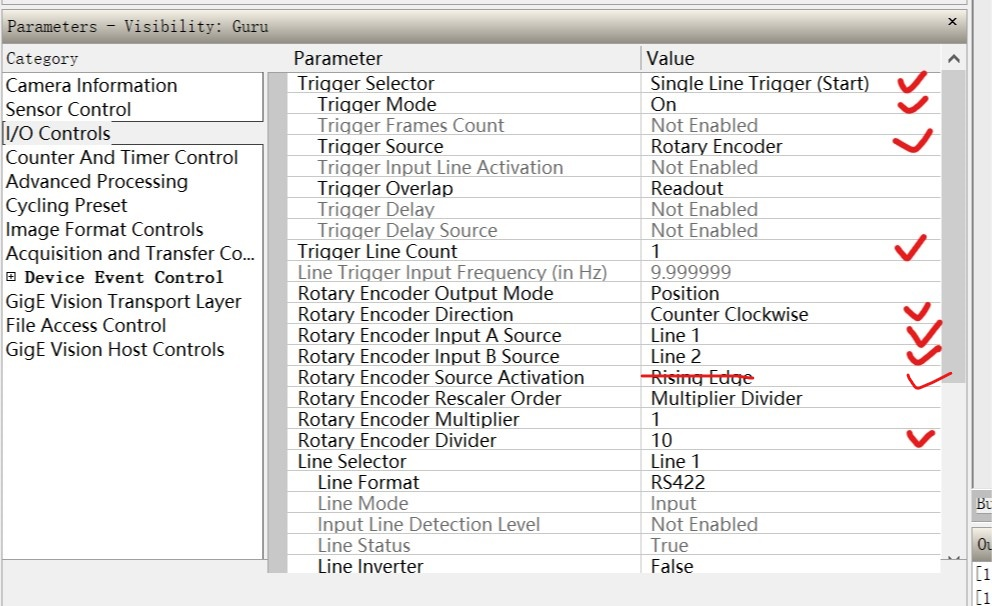

## 线扫相机应用实例 ##  
**前言：**  
线阵相机，顾名思义是呈“线”状的。虽然也是二维图象，但极长，几K的长度，而宽度却只有几个象素的而已。一般上只在两种情况下使用这种相机：一、被测视野为细长的带状，多用于滚筒上检测的问题。二、需要极大的视野或极高的精度。  

***  
**选型：**  
相机:LA-GM-08K08A-00-R
镜头:OPT-F5028-29MP
光源:CMAG4216
***  
**机构安装：**  
  
原点、极限和触发光电开关设计：  
  
# 采用内部触发(不用编码器)： #  
硬件触发配线原理：  
  
Dalsa GigE相机设置步骤：  
1. 设置静态IP和相机名  
  
  
2. 恢复出厂设置  
  
2. 设置触发方式——外部触发  
  
  
3. 设置图像分辨率  
  
4. 保存设置  
  
***
**软件设计：**  
- 上位机设计  
  

上位机与PLC的接口：  

|寄存器|功能|备注|方向|
|-|-|-|-|
|HD400|运行频率|控制图片拉长或缩短|写入
|HD302|触发位置|软件触发模式下，开始拍照的位置|写入
|M401|拍照命令|控制PLC开始执行拍照动作|写入
|M409|急停按钮|控制PLC急停|写入
|D2|模组实际位置|读取模组实际位置，由PLC读取伺服位置|读取
|M410|“回原点完成”信息打印|-|读取
|M411|"触发拍照"命令触发|软件触发模式下，读取到信号就开始拍照。由于读取由延时，图像会有前移或滞后。|读取

- PLC程序设计
    - 控制伺服电机动作：回原点、定位
    - 高速计数器读取实时读取伺服反馈的位置
    - 根据要求实现拍照动作
    - 软件触发、硬件触发模式切换
    - 响应急停  

实例展示  
  
<video src="VID_20191126_171002.mp4" width="960" height="540"
controls="controls">  
# 采用编码器触发： #  
说明：  
1. 编码器只是行触发信号（Line），开始拍照信号还是帧（Frame）信号。所以要接3个信号，Line1为A相（差分）、Line2为B相（差分）、Line3为开始信号（集电极）
  
相机设置：  
帧触发设置和之前设置一样，只是从Line1换到Line3，只是Line3端口是双向的，要选成“输入”，并且设置成24V集电极信号。
   
设置行触发(Line)触发信号，选择编码器触发(Rotary Encoder)  
Trigger Line Count:触发1次，拍几几次  
Rotary Encoder Divider:多少个脉冲，拍1次
  
由于我们设置了10个脉冲拍1次，每个脉冲对应0.001mm，设置的图片高度为2600，我们得到如下被压缩的图像。  
  
我们需要将图片高度像素拉伸10倍。  
  
可以借助halcon图像缩放算子实现图像拉伸  
```
zoom_image_factor (Image, ImageZoomed, 1, 10, 'bilinear')
```  

补充说明：  
1. 关于编码器的频率  
相机能接收的频率范围如图所示，最大为20MHz。我们轴输出频率一般不会超过200KHz。  
  
相机的行频参数(Line Rate)对编码器的脉冲频率没有影响。例如，相机行频参数为13KHz，编码器频率为50KHz也是没有影响的。